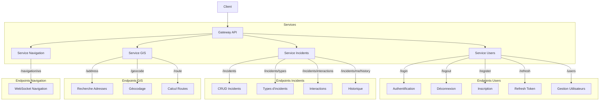

# supmap-gateway

Une gateway API légère et performante écrite en Go, permettant de router et de rediriger les requêtes vers différents microservices.

## Fonctionnalités

- Reverse proxy pour plusieurs microservices :
    - Service Utilisateurs (authentification, gestion des comptes)
    - Service Incidents (gestion et suivi des incidents)
    - Service GIS (géocodage et services géographiques)
    - Service Navigation (WebSocket pour la navigation en temps réel)
- Configuration simple via variables d'environnement
- Support des WebSockets
- Gestion des routes avec réécriture d'URL

## Architecture

La gateway agit comme un point d'entrée unique pour différents microservices :



## Configuration

La configuration se fait via des variables d'environnement :

| Variable               | Description                  |
|------------------------|------------------------------|
| SUPMAP_GATEWAY_PORT    | Port d'écoute de la gateway  |
| SUPMAP_USERS_HOST      | Hôte du service utilisateurs |
| SUPMAP_USERS_PORT      | Port du service utilisateurs |
| SUPMAP_INCIDENTS_HOST  | Hôte du service incidents    |
| SUPMAP_INCIDENTS_PORT  | Port du service incidents    |
| SUPMAP_GIS_HOST        | Hôte du service GIS          |
| SUPMAP_GIS_PORT        | Port du service GIS          |
| SUPMAP_NAVIGATION_HOST | Hôte du service navigation   |
| SUPMAP_NAVIGATION_PORT | Port du service navigation   |

🔌 Points d'accès (Endpoints)
- Service Utilisateurs
  - /login - Authentification
  - /logout - Déconnexion
  - /register - Création de compte
  - /refresh - Rafraîchissement du token
  - /users - Gestion des utilisateurs
- Service Incidents
  - /incidents - CRUD des incidents
  - /incidents/types - Types d'incidents
  - /incidents/interactions - Interactions sur les incidents
  - /incidents/me/history - Historique personnel
- Service GIS
  - /address - Recherche d'adresses
  - /geocode - Géocodage
  - /route - Calcul d'itinéraires
- Service Navigation
  - /navigation/ws - WebSocket pour la navigation en temps réel

## Démarrage
Configurez les variables d'environnement nécessaires
Lancez l'application :

```sh
go run .
```

## Développement

Le projet utilise :
- net/http/httputil pour le reverse proxy
- github.com/caarlos0/env/v11 pour la gestion de la configuration
- Go modules pour la gestion des dépendances